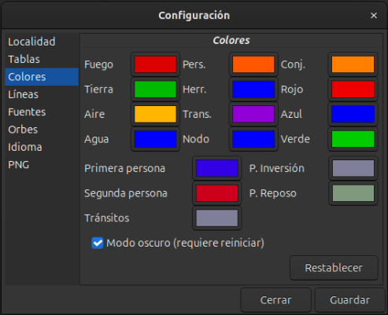

# Astro-Nex (Python 3 / GTK3)

Astronex is an astrology program for calculating and drawing charts according to the API Method. Used in Huber method. Python 3 version.

# Light/Dark mode


> Under **Settings -------> Colours**, you can switch the interface between **Light** and **Dark** Mode.

<p align="center">
  
</p>

> ## In the **['Releases'](https://github.com/Uthopik/astronex-python-3/releases/tag/v2.1)** section, you’ll find four files for Windows and Linux:

## Windows

- **Astro-Nex-Dark-v2.1-setup.exe** (Windows installer) **[Download](https://github.com/Uthopik/astronex-python-3/releases/download/v2.1/Astro-Nex-Dark-v2.1-setup.exe)**
- **Astro-Nex-Portable.exe** (Portable version) **[Download](https://github.com/Uthopik/astronex-python-3/releases/download/v2.1/Astro-Nex-Portable.exe)**

> ⚠️ There may be download issues with an unknown **.exe** on **Windows**, in **Chromium based** browsers. In that case, please **[download](https://github.com/Uthopik/astronex-python-3/releases/download/v2.1/Astronex-Dark-v2.1.zip)** the **.zip** file. **[Here](https://github.com/Uthopik/astronex-python-3/releases/download/v2.1/Astronex-Dark-v2.1.zip)**

## Linux

- **Astro-Nex-Dark-v2.1.AppImage** **[Download](https://github.com/Uthopik/astronex-python-3/releases/download/v2.1/Astro-Nex-Dark-v2.1.AppImage)**
- **astro-nex-dark-v2.1.deb** **[Download](https://github.com/Uthopik/astronex-python-3/releases/download/v2.1/astro-nex-dark-v2.1.deb)**

## macOS

- **Astro-Nex-v2.0-macOS-arm64.dmg** **[Download](https://github.com/isaiass18/Astro-Nex-Python-3/releases/download/v2.0/Astro-Nex-v2.0-macOS-arm64.dmg)**

> ⚠️ I don’t have a version for **macOS** at the moment. I’m providing **[Isaiass18](https://github.com/isaiass18/Astro-Nex-Python-3)**’s version, which doesn’t have a **dark mode**. His build only works on Macs with an Apple Silicon processor: M1, M2, M3, M4 or later, and macOS 26.0 or later. It is not compatible with Intel Macs or with macOS 11, 12, 13, 14 or 15.


## Installation

- On **Windows**, simply double-click the file and, if prompted for permission, grant it.

- On **Linux**, right-click the **AppImage** file and grant permission via the **‘Permissions’** menu. Alternatively, in the terminal, grant permission using:

```bash
chmod +x ./Astro-Nex-Dark-v2.1.AppImage
```

- On **Debian-based** Linux distributions **(Ubuntu, Linux Mint,...)**, you can install it using a **.deb** file. Open the terminal where the file is located and run this command:

```bash
sudo apt install ./astro-nex-dark-v2.1.deb
```

- On **Arch-based** Linux distributions **(Cachy, Manjaro, Endeavour,...)** you can install it via **AUR**:

```bash
yay -S astronex
```
## Source code

- **[New Source Code of Astronex in python 3](https://github.com/Uthopik/astronex-python-3/releases/download/v2.1/astronex-dark-py3-v2.1.tar.gz)**

- **[Old Source Code of Astronex in python 2](https://github.com/Uthopik/astronex-python-3/releases/download/v2.1/astronex-py2-v1.2.tar.gz)**

- **[Old Windows Installer v1.2](https://github.com/Uthopik/astronex-appimage/releases/download/v1.2/Astro-Nex-1.2.3p.exe)**

## Other links of interest

- The project’s official website: (https://www.astro-nex.net)
- Isaiass18’s Python 3 version of Astronex: (https://github.com/isaiass18/Astro-Nex-Python-3)
- Website of **Gabriel Jorba**, an astrologer specialising in the **Huber Method** (https://www.astrologiaespecial.com)
- https://escuelahuber.org/


